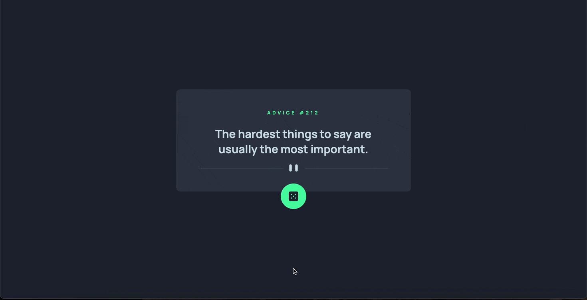

# Advice Generator App

**By: Brian Cheng**

## Table of Contents

1. [Demo](#demo)
2. [About the Project](#about-the-project)
3. [Why I Built This Project](#why-i-built-this-project)

## Demo

If you want to try the project out for yourself,
<a href="https://superlative-cajeta-14d4c0.netlify.app"><strong>click here!</strong></a>

**Here's a visual walkthrough of the project!**

## About The Project

This project uses the <a href="https://api.adviceslip.com">Advice Slip JSON API</a> to randomly generate a new piece of advice whenever the dice button is clicked.

### Built With

- HTML5 Markup
- CSS
- Javascript
- Flexbox
- Media Queries
- Fetch
- Async/Await

## Why I Built This Project

It's really accessible and a simple app that anybody can use. Whether it's to come across words of wisdom or even generate funny advice, users can keep clicking the button until they find something that can make a positive impact on their day.
